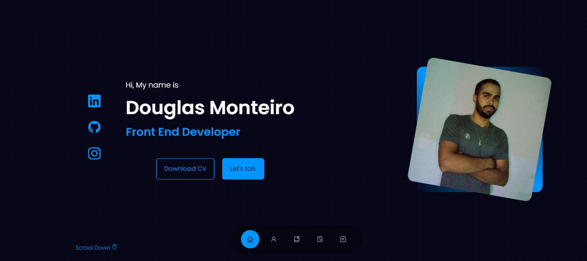

# MEU WEBSITE

 

     
 

## Objetivo:

### Objetivo desse projeto foi criar um site onde eu possa mostrar um pouco sobre mim, habilidades e opções de contato.

## Descrição:

- `Projeto feito com React JS.`
- `Minhas skills.`
- `Projetos recentes com link do github.`
- `Formulário de contato.`
- `Minhas redes sociais.`

## <i>Douglas Monteiro</i> 😁🔥🚀
